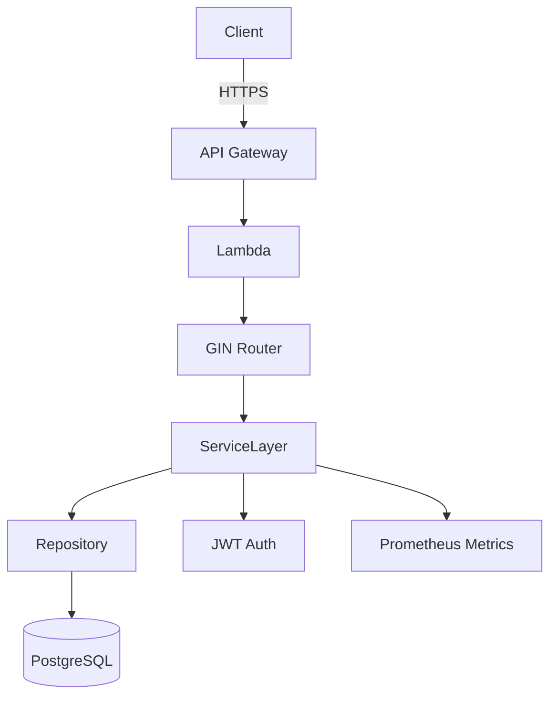

# Network API for Go + Gin

## Overview
This project implements a network commerce API built with Go and Gin. It provides category, product, and supplier management backed by PostgreSQL and is designed for deployment on AWS Lambda behind API Gateway.

## Architecture Summary
- `go-gin-boilerplate`: baseline Gin application structure. We extend it with layered repositories, services, and OpenAPI-first scaffolding.
- `db-samples`: provides relational data samples used for schema inspiration. We adapt naming to align with domain-driven aggregates and add auditing columns.
- We introduce AWS Lambda deployment, OpenTelemetry instrumentation, and RBAC that are not present in the reference repositories.

### Component Diagram


## Repository Layout
- `cmd/` application entrypoints (`api`, `migrate`)
- `internal/` domain logic, repositories, and services
- `pkg/` shared utilities (`config`, `logger`, `auth`)
- `configs/` static configuration templates
- `scripts/` automation helpers for local and CI workflows
- `docs/` architecture, roadmap, and implementation notes
- `testdata/` seed and fixture files
- `api/` OpenAPI specifications and codegen configuration

## Next Steps
Follow the roadmap in `docs/implementation-roadmap.md` to execute each phase.

## API Contract
- The canonical OpenAPI definition lives at `api/openapi.yaml` and models CRUD workflows for categories, products, and suppliers along with JWT scope expectations.
- Regenerate Gin handlers and types after editing the specification with `make generate` (requires `oapi-codegen` on your `PATH`).

## Authentication
- All category, product, and supplier routes require a bearer token with the scopes defined in the OpenAPI document (viewer for read, manager for updates, admin for destructive operations).
- A static administrator account is provided via the environment variables `AUTH_ADMIN_USERNAME` and `AUTH_ADMIN_PASSWORD`; defaults are `admin` / `changeit` for local development only.
- Signing configuration is controlled through `TOKEN_SECRET`, `TOKEN_KEY_ID`, `TOKEN_TTL`, `TOKEN_AUDIENCE`, and `TOKEN_ISSUER`.

### Obtaining a Token Locally
```bash
curl -s \
  -X POST http://localhost:8080/auth/token \
  -H 'Content-Type: application/json' \
  -d '{"username":"admin","password":"changeit","scope":"viewer"}'
```

Use the returned `accessToken` in the `Authorization: Bearer <token>` header when calling protected endpoints.

## Testing & Quality Gates
- `make test` runs the Go unit and integration suite.
- `make integration` spins up PostgreSQL via Docker Compose, runs database migrations, and executes the catalog integration suite against the real database (requires Docker).
- The integration harness exposes Postgres on `DB_PORT` (default `55432`) so it can run alongside a local Postgres instance.
- `make smoke` exercises the API using `local-test.http`; update `local-test.http` if environment values differ.
- `k6 run scripts/k6/smoke.js` (or `make k6-smoke`) issues an auth/token request, lists categories, and creates then deletes a category to validate basic flows; the scenario enforces zero failures and a 95th percentile latency under 500ms with default `K6_ITERATIONS=10` and `K6_VUS=1`.
- `make sbom` generates a CycloneDX SBOM at `sbom/bom.json` using `cyclonedx-gomod`.

## Security & Observability
- Default response headers include `Content-Security-Policy`, `X-Frame-Options`, `X-Content-Type-Options`, and `Strict-Transport-Security`. Set `DISABLE_HSTS=true` if running over plain HTTP in non-production environments.
- Rate limiting is enabled per client IP with `RATE_LIMIT_RPS` (default `25`) and `RATE_LIMIT_BURST` (default `50`). Requests beyond the burst window receive `429` responses.
- Audit logs are emitted for mutating verbs (POST/PUT/PATCH/DELETE) and include subject, scopes, latency, and request identifier.
- OpenTelemetry tracing is configured via `OTEL_EXPORTER_OTLP_ENDPOINT`, optional `OTEL_EXPORTER_OTLP_HEADERS`, and `OTEL_EXPORTER_OTLP_INSECURE=true` when sending to an insecure collector. Service identity defaults can be tuned with `SERVICE_NAME`, `SERVICE_VERSION`, and `APP_ENV`.
- A scheduled `govulncheck` workflow scans dependencies weekly; SBOM artifacts are generated in CI for downstream transparency.
